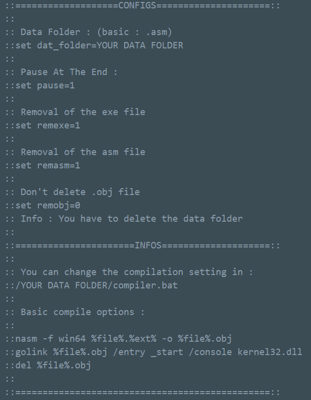
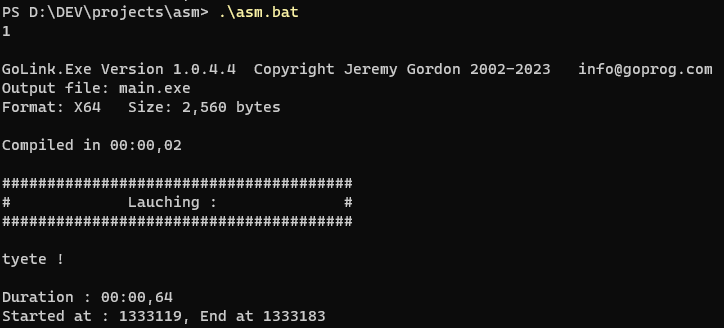

# ASM compiler

Just a basic compiler for people Who wants to code in asm but are to lazy to compile it. 
Probably not perfect I don't care.

# Installation :
Put the asm.bat file wherever you want. 
Go in options and just configure it if you want. 
It basically uses nasm and gofile but you can change all compiling options with your compiler : IT'S FULLY CONFIGURABLE. 
 
And finally just have fun ! 

